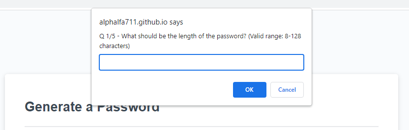

# 03 JavaScript: Password Generator

## Github repo link
[Github repository](https://github.com/mnyzio/password-generator)

## Link to deployed website
[Link to deployed site](https://mnyzio.github.io/password-generator/)

## Description

```
This website was designed to help users generate random and complex
password based on their preference. Users have abitlity to choose 
types of characters to be included in their password.

After clicking "Generate Password" user is presented with 
various prompts to either accept or reject specified characters. 

As long as user accepted at least one category of characters to 
be selected in the password new randomly generated phrase will 
display on the main screen.
```

## Steps
```
1. Click "Generate Password" button
2. Enter number between 8 and 128 for desired length of password
3. When prompted either accept / deny lowercase letters to be included in new password
4. When prompted either accept / deny uppercase letters to be included in new password
5. When prompted either accept / deny numbers to be included in new password
6. When prompted either accept / deny special characters to be included in new password
7. Based on provided answers new password will be displayed in text box
8. Copy and save generated code
```

## Prompt example

The following image shows the web application's prompt to user for input / confirmation




## Mock-Up

The following image shows the web application's appearance and functionality:


